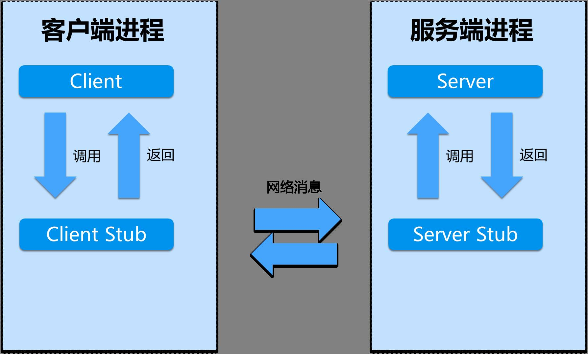

# GRPC

## 什么是rpc
远程过程调用（Remote Procedure Call)，为什么要进行rpc调用呢？
不在一个进程，不同的系统，不同的语言，不同的部门，服务需要横向扩展，集群部署等

### 本地调用

```go
func Sum(a1, b1 int) int{
    result :=  a1 + b1
    return result
}  

func main(){
    a := 1
    b := 2
    c := Sum(a,b)
    fmt.Println(c) //3
}
```

调用流程：

1. 将a 和 b 的值压栈进入Sum函数
2. 取出栈中的值1 和 2，将其赋予 a1 和 b1 执行第2行代码
3. 计算 a1 + b1 ,将结果存在 result 
4. result压栈 然后从Sum返回
5. 从栈中取出返回值 3 ，并赋值给 c, 打印结果


### 远程调用：

1. Call ID映射：在RPC中，所有的函数都必须有自己的一个ID，这个ID在所有进程中都是唯一确定的。
客户端在做远程过程调用时，必须附上这个ID。然后我们还需要在客户端和服务端分别维护一个 {函数 <--> Call ID} 的对应表

2. 序列化和反序列化：客户端把参数先转成一个字节流，传给服务端后，再把字节流转成自己能读取的格式。这个过程叫序列化和反序列化。同理，从服务端返回的值也需要序列化反序列化的过程。

3. 网络传输: 客户端和服务端是通过网络连接的.网络传输层需要把Call ID和序列化后的参数字节流传给服务端，然后再把序列化后的调用结果传回客户端,只要能建立连接传输数据无论是tcp，udp，或者直接http都可以

只要完成上面的流程就可以称为 rpc

### 流行的RPC框架
目前流行的开源RPC框架还是比较多的。下面重点介绍三种：

- gRPC是Google最近公布的开源软件，基于最新的HTTP2.0协议，并支持常见的众多编程语言。 我们知道HTTP2.0是基于二进制的HTTP协议升级版本，目前各大浏览器都在快马加鞭的加以支持。 这个RPC框架是基于HTTP协议实现的，底层使用到了Netty框架的支持。
- Thrift是Facebook的一个开源项目，主要是一个跨语言的服务开发框架。它有一个代码生成器来对它所定义的IDL定义文件自动生成服务代码框架。用户只要在其之前进行二次开发就行，对于底层的RPC通讯等都是透明的。不过这个对于用户来说的话需要学习特定领域语言这个特性，还是有一定成本的。
- Dubbo是阿里集团开源的一个极为出名的RPC框架，在很多互联网公司和企业应用中广泛使用。协议和序列化框架都可以插拔是及其鲜明的特色。同样 的远程接口是基于Java Interface，并且依托于spring框架方便开发。可以方便的打包成单一文件，独立进程运行，和现在的微服务概念一致

## rpc 和 http区别 ?
根据上面说的rpc定义，http是rpc的一个子集，而不是一个并行概念。
所以真正的问题是：为什么rpc使用的是tcp作为通信协议而不是使用http1.x（http2 较于http1）
http也是支持连接复用的，http也支持protobuf高效的编码方式的。
所以真正的原因是：

1. http报文太多无用的数据

```
HTTP/1.x 200 OK 
Content-Type: text/plain
Content-Length: 137582
Expires: Thu, 05 Dec 1997 16:00:00 GMT
Last-Modified: Wed, 5 August 1996 15:55:28 GMT
Server: Apache 0.84

<html>
  <body>Hello World</body>
</html>
```
2. http有各种调用方式，post，get，put等，导致不如rpc那样简单
3. 因为良好的rpc调用是面向服务的封装，针对服务的可用性和效率等都做了优化。单纯使用http调用则缺少了这些特性。
简单来说成熟的rpc库相对http容器，更多的是封装了“服务发现”，"负载均衡"，“熔断降级”一类面向服务的高级特性。可以这么理解，rpc框架是面向服务的更高级的封装。如果把一个http servlet容器上封装一层服务发现和函数代理调用，那它就已经可以做一个rpc框架了。


## http1 和HTTp2
- 新的二进制格式（Binary Format）：HTTP1.x的解析是基于文本。基于文本协议的格式解析存在天然缺陷，文本的表现形式有多样性，要做到健壮性考虑的场景必然很多，二进制则不同，只认0和1的组合。基于这种考虑HTTP2.0的协议解析决定采用二进制格式，实现方便且健壮。

- 多路复用（MultiPlexing）：即连接共享，即每一个request都是是用作连接共享机制的。一个request对应一个id，这样一个连接上可以有多个request，每个连接的request可以随机的混杂在一起，接收方可以根据request的 id将request再归属到各自不同的服务端请求里面。

- header压缩：如上文中所言，对前面提到过HTTP1.x的header带有大量信息，而且每次都要重复发送，HTTP2.0使用encoder来减少需要传输的header大小，通讯双方各自cache一份header fields表，既避免了重复header的传输，又减小了需要传输的大小

- 服务端推送（server push）：同SPDY一样，HTTP2.0也具有server push功能

- 请求并行：HTTP/1.1 Pipeling解决方式为，若干个请求排队串行化单线程处理，后面的请求等待前面请求的返回才能获得执行机会，一旦有某请求超时等，后续请求只能被阻塞，毫无办法，也就是人们常说的线头阻塞；HTTP/2多个请求可同时在一个连接上并行执行。某个请求任务耗时严重，不会影响到其它连接的正常执行；

## 多路复用
### 例子
```
假设你是一个老师，让30个学生解答一道题目
然后检查学生做的是否正确，你有下面几个选择：
1. 按顺序逐个检查，先检查A，然后是B，之后是C、D。。。这中间如果有一个学生卡主，全班都会被耽误。
2. 30个老师一个老师管一个学生 这种类似于为每一个用户创建一个进程或者线程处理连接
3. 你站在讲台上等，谁解答完谁举手
```
第三种就是IO多路复用

### 原理
操作系统为你提供了一个功能，当你的某个socket可读或者可写的时候，它可以给你一个通知
这样当配合非阻塞的socket使用时，只有当系统通知我哪个描述符可读了，我才去执行read操作，而不必浪费时间去阻塞等待。
多个描述符的I/O操作都能在一个线程内并发交替地顺序完成，这就叫I/O多路复用，这里的“复用”指的是复用同一个线程

## Restful

## grpc
### 两种调用方式
1. Unary RPC：一元 RPC
2. Server-side streaming RPC：服务端流式 RPC
3. Client-side streaming RPC：客户端流式 RPC
4. Bidirectional streaming RPC：双向流式 RPC

### 交互流程
- MetaData
在建立连接，或者每次请求的时候 使用metadata来建立 数据规则（超时，解析方式等）

- 认证

- 链路追踪


## grpc 请求超时 & Context
见 context.md

客户端：
与服务端建立连接，导致的超时
发送请求到服务端，写报文导致的超时
等待服务端处理时，等待处理导致的超时（比如服务端已挂死，迟迟不响应）
从服务端接收响应时，读报文导致的超时

服务端：
读取客户端请求报文时，读报文导致的超时
发送响应报文时，写报文导致的超时
调用映射服务的方法时，处理报文导致的超时

- GoRoutine泄漏
- HealthCheck
- Graceful Stop
- 标准返回码


## IDL
- IDL
- JSON 差别
- HTTP RESTFul/RPC 差别

## 滑动窗口算法


## 其他
[tcp三次握手](https://www.cnblogs.com/liang1101/p/13202738.html)

### 实操
见代码 xrpc

### 实践前准备
- 反射
```go
type People struct{
}

func (p *People)Eat(a int){
}

func (p *People)Say(){
}


func main() {
    typ := reflect.TypeOf(&People{})
    for i := 0; i < typ.NumMethod(); i++ { //函数数量
        method := typ.Method(i)//具体函数
        
        //参数和返回值
        argv := make([]string, 0, method.Type.NumIn())
        returns := make([]string, 0, method.Type.NumOut())
        
        for j := 1; j < method.Type.NumIn(); j++ {
          argv = append(argv, method.Type.In(j).Name())
        }
        
        for j := 0; j < method.Type.NumOut(); j++ {
          returns = append(returns, method.Type.Out(j).Name())
        }
        
        log.Printf("func (w *%s) %s(%s) %s", typ.Elem().Name(), method.Name, strings.Join(argv, ","), strings.Join(returns, ","))
    }
    //func (p *People)Eat(int)
    //func (p *People)Say()
}

```

- net/rpc 接口规则

一个函数需要能够被远程调用，需要满足如下五个条件
- the method’s type is exported. – 方法所属类型是导出的。
- the method is exported. – 可被外调用
- the method has two arguments, both exported (or builtin) types. – 两个入参，均为导出或内置类型。
- the method’s second argument is a pointer. – 第二个入参必须是一个指针。
- the method has return type error. – 返回值为 error 类型。

## 参考
[rpc与http](https://www.zhihu.com/question/41609070)

[http1 和 2](https://www.jianshu.com/p/f63ffeec7e49)

[多路复用](https://ninokop.github.io/2018/02/18/go-net/)

[多路复用2](https://www.zhihu.com/question/28594409)

[多路复用3](https://juejin.cn/post/6844904200141438984)