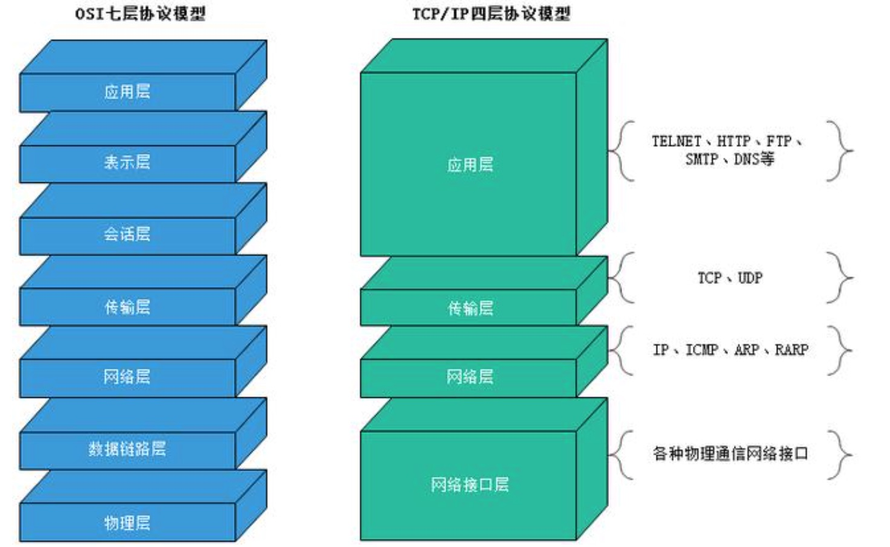
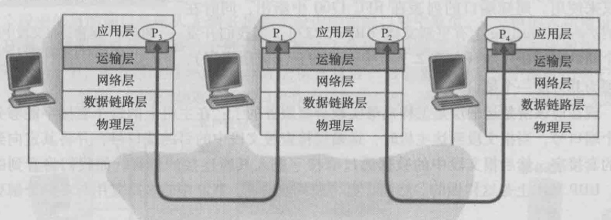
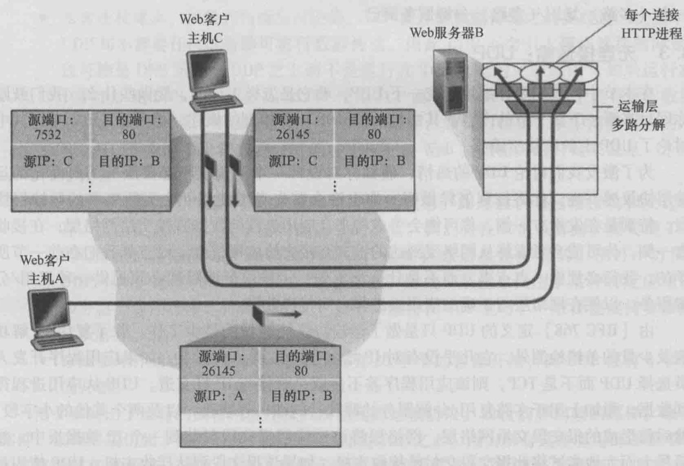
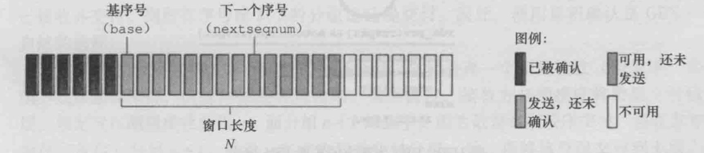
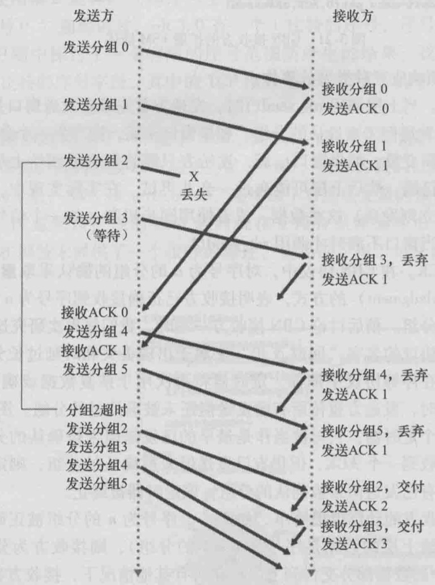
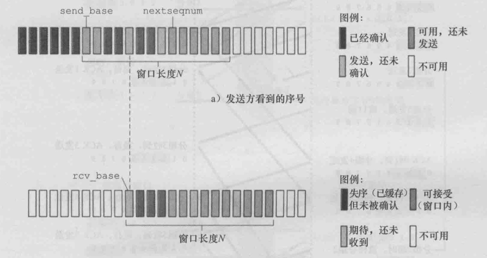
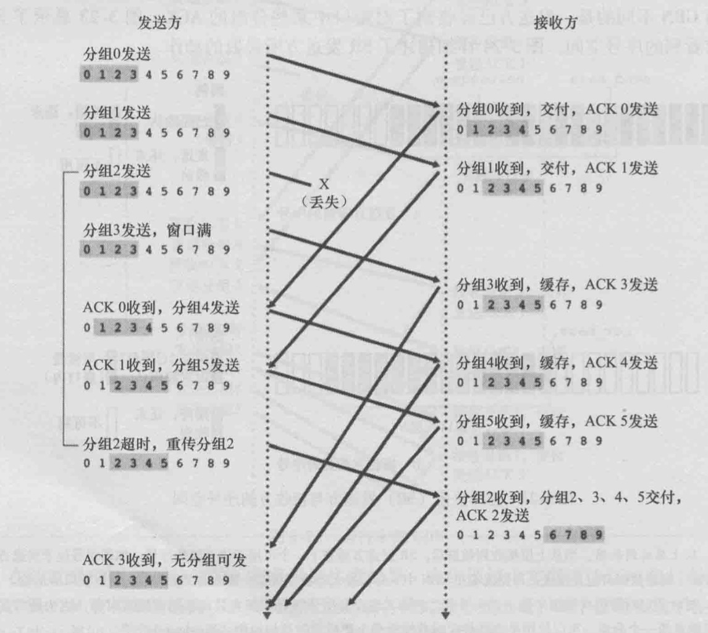
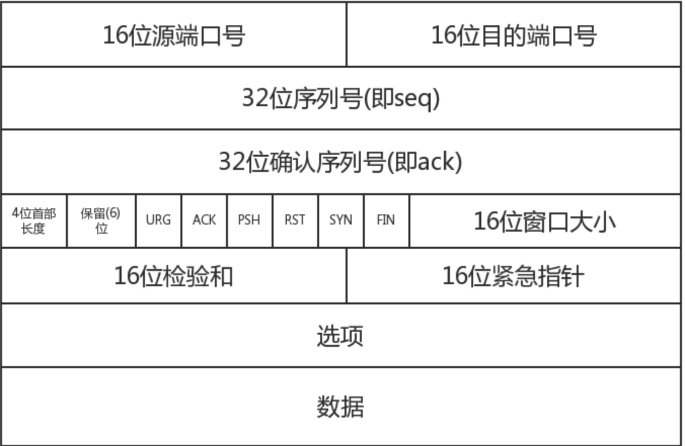

# tcp&udp

## TCP/IP 模型


## 运输层
与应用层的关系：应用层将数据发送给运输层，运输层将其进行分段处理，每段数据加入头协议，然后分组发出去
与网络层的关系：分组的数据发给网络层，网络层将数据真正的发给链路层，然后从物理链路发到指定服务的进程中去

举例：
北京一个资产阶级家庭： 小明家庭
天津一个资产阶级家庭： 小红家庭
小明写了封信，交给管家，管家将信给邮政局，邮政局收到后，寄到天津小红家，管家将信给小红

小明家庭的任意成员写信->小明家的管家->邮局->小红家的管家->小红

应用层：信的内容
进程：小明
主机：小明的家庭 和 小红的家庭
运输层：管家
网络层：邮局

## 简单介绍udp tcp
tcp将应用层数据，分段处理 称为 报文段（seg-ment)
upd将应用层数据，分段处理 称为 数据报

IP层 网际协议，为主机之间提供逻辑通信，尽力而为的交付服务（best-effort delivery service)
所以不保证数据不会丢失，报文段的顺序，并且附带了一个唯一表示的地址也就是ip地址来进行主机之间的确认

udp和tcp 的基本责任是对两个端系统间的进程进行交付服务。
主机间交付扩展到进程间交付被称之为 运输层的多路复用，与多路分解

udp和ip层一样 无法提供可靠传输

tcp通过流量控制，序号，确认，定时器，达到可靠传输
tcp通过滑动窗口达到拥塞控制，为整个互联网提供平等的带宽

## 多路复用，多路分解


一个主机有多个进程，每个进程为了通信会建立一个套接字（socket)，而一个主机只有一个运输层，所以多个socket将数据传输给运输层，运输层将这些数据进行封装上首部信息（为了以后的分解）从而生成报文段。然后将报文段传递给网络层，这个过程就是多路复用。

当主机收到其他主机的数据，运输层根据报文段的首部信息找到指定的socket。这个过程就是多路分解

举例：依旧是上面的例子，当管家收到信件后，需要依靠信件上的名字，给指定的成员（小明，爸爸，妈妈）。
这个管家的操作就是多路分解。当成员（小明，爸爸，妈妈）写了信给管家，管家进行整理然后发送给邮政局，这个管家的操作就是多路复用

通过上述描述，运输层的多路复用的要求是：
1. 每一个套接字要有唯一的标识，否则运输层无法分辨该将数据给谁
2. 每个报文段要有特殊的字段来标识，要交付给哪个套接字（也就是端口 port）

|-----------------|
| 源端口 | 目的端口 |
|-----------------|
|   其他首部字段    |
|-----------------|
|    应用数据      |
|-----------------|

### udp的多路复用 多路分解
一个udp套接字使用一个二元组来全面标识，该二元组包含：一个目的IP地址和一个目的端口号。
所以多个客户端连接到同一个进程的同一个套接字

### tcp的多路复用 多路分解
一个tcp套接字使用一个四元组来全面标识，该四元组包含：一个目的IP地址和一个目的端口，一个源地址和一个源端口。所以每一个客户端连接都会维护一个套接字，一个tcp服务会维护多个套接字管理多个客户端连接



## udp
udp其实就是做了点 多路复用/多路分解，除此之外没任何额外功能，和网络层唯一区别就是这点功能。由[RFC 768](https://tools.ietf.org/html/rfc768)定义的UDP只做运输层能够做的最少工作。

udp将数据附加上多路复用/分解服务的源和目的端口字段，以及其他两个小字段后，将报文段交给网络层。网络层将报文段封装到一个IP数据报中，然后尽力而为交给目的主机，到达后udp进行多路分解交付给指定的进程，在发送数据前并没有与接收方进行握手确认。所以udp被称为 `无连接的`

### udp优点
- 关于何时，发送什么数据的应用层控制更为精细：tcp为了可靠传输不管交付用多长时间，udp不提供不必要的额外功能所以更快
- 无需建立连接：意味着不会有建立连接的延迟
- 无连接状态：tcp为了实现可靠传输会维护连接状态，udp没有，因此一般情况udp的能支持更多的用户量
- 分组首部开销小： tcp报文段20个字节的首部开销，udp8字节

udp是可以进行可靠传输的，那就是在应用层进行可靠传输的逻辑处理。一旦这样是不是udp就成了最好的解决方案了？ 相当于tcp和udp优点的结合，而抛弃了tcp的拥塞控制。
答案是错误的，虽然看起来是可行的，但对于整个互联网是造成了压力，间接的提高了udp的丢包率。

举例：如果把拥塞控制比喻成城市的红绿灯，udp汽车不管红绿灯，在车少的时候当然非常快速，很快就能达到目的。但当汽车很多，所有人都不遵守交通规则，那么反而不如tcp汽车遵守交通规则来的更快。

### udp报文段
首部四个字段，都是2字节，一共8字节
+--------+--------+--------+--------+
|     Source      |   Destination   |
|      Port       |      Port       |
+--------+--------+--------+--------+
|                 |                 |
|     Length      |    Checksum     |
+--------+--------+--------+--------+
|                                   |
|          data                     | 
+-----------------------------------

1. 源端口：源端口号。在需要对方回信时选用。不需要时可用全0
2. 目的端口：目的端口号。这在终点交付报文时必须要使用到
3. 长度： UDP用户数据报的长度，其最小值是8（仅有首部）
4. 校验和：检测UDP用户数据报在传输中是否有错。有错就丢弃

### udp校验和计算
校验和提供了差错检测功能。也就是说，报文段从源到达目的地的过程中，判断比特是否发生了改变（链路中的噪声干扰或者路由器的问题）。发送方的udp对报文段中的所有16比特字的和进行反码运算，求和时遇到溢出都会被回卷。得到的结果放到校验和字段`checksum`

举例：
字段            十进制             二进制
源端口            63549          1111100000111101  
目的端口          12345           11000000111001
数据长度            17              10001
校验和          

发送前计算校验和：
1. 源端口+目的端口+数据长度 = 1111100000111101+0011000000111001+10001 = 10010100010000111
2. 16位溢出，回卷，抛弃首位：10010100010000111 ==> 0010100010000111
3. 反码：0010100010000111==>1101011101111000
4. 校验和 = 1101011101111000

接受后检验校验和：
1. 源端口+目的端口+数据长度 = 1111100000111101+0011000000111001+10001 = 10010100010000111
2. 16位溢出，回卷，抛弃首位：10010100010000111 ==> 0010100010000111
3. 结果与校验和相加：0010100010000111（计算结果） + 1101011101111000(校验和)
4. 如果结果不为 1111111111111111（16个1） 则一定有问题；如果结果为16个1，则表示可能没错（单比特翻转）

结论：校验和功能，不只是在传输层，在网络层，链路层也会做校验，每一层都会做自己首部的校验处理。虽然如此，依旧不能保证最终的无误。传输层的做的最后校验也会有几率检查不出来（单比特翻转）
概率虽然低，但依旧有可能。这时需要依靠应用层做最终的校验

## 可靠传输
可靠传输协议（reliable data transfer protocol)是使用一个个的技术点组合达到最终的可靠传输。
所以我们一个个了解，最终迭代出一个可靠传输的最终版本，当了解了这些可靠传输的每一个原理，就能在应用层用udp实现可靠传输了。

### 经完全可靠信道的可靠数据传输 rdt1.0
当传输保证可靠，发送与接收端的收发效率也完全一致的时候模型

发送端：
rdt_send(data)

packet=make_pkt(data)
udt_send(packet)

接收端：
rdt_rcv(packet)

data=extract(packet)
deliver_data(data)

完全不必加入额外的任何操作

### 能处理比特差错信道的可靠传输 rdt2.0
在发送数据的整条链路中，比特可能受损，除此之外其他依旧假定可靠。
在和别人打电话的时候，如果听到了对方完整的话，会说一句’ok'，来证明自己听到了全部内容，且听懂了。
这个‘ok' 使用了 `肯定确认（positive acknowledgment）` 与`否定确认（negative acknowledgment）` (没听到说一句’请你再说一遍‘)
当对方收到 肯定确认就开始说下一句了， 但当收到否定确认，就要重新说一遍刚才说的话。
基于上面的重传机制的可靠传输协议称之为 `自动重传请求（AutomaticRepeat reQuest, ARQ）`协议

一共三个功能处理比特差错：
1. 差错检测：和上面的udp一样
2. 接收方反馈：收到的消息回答 肯定确认ACK 或者NAK。接收方需要向发送方发送一个报文段，其中一个字段只需要1bit，0（nak）或者1（ack）
3. 重传：接收方收到有差错的分组时，重传刚才的报文段

发送方流程：
1. rdt_send(data)
2. sndpkt=make_pkt(data, checksum)
3. udt_send(sndpkt)
4. 如果有差错 rdt_rcv(rcvpkt)&&isNAK(rcvpkt) 重传 udt_send(sndpkt)
5. 如果无差错 rdt_rcv(rcvpkt)&&isACK(rcvpkt) 继续下一个数据

接收方：
在原有基础上多了个 回复：
rdt_rcv(packet)

data=extract(packet)
deliver_data(data)

如果数据校验正确则回复ack 否则 nak

由于发送方在没有收到回复的时候要一直等着，不能发送下一个报文段，因此这样的协议 被称为 `停等（stop and wait）`协议

至此，看起来是可行了，但ack和nak 出现了比特差错怎么办？
当接收方收到由差错的ack或者nak的时候，重传当前数据即可，这种方式 叫`冗余分组 duplicate packet`。但重传了冗余的数据，接收方因为无法确认，对方是否正确收到ack或者nak，所以不确定这次数据是新的，还是冗余的。这个解决方案有个简单方法（当前所有传输协议几乎都用这个方法）就是在数据分组里添加个新字段，对数据进行编号，将发送数据分组的`序号(sequence number)`放到这个字段。
在rdt2.0 的基础上添加个新字段 做 rdt2.1 来处理上面的问题。
当前rdt2.0是停等协议，所以无需让序号递增，只需要1个bit，区分本次数据和上次数据即可。

### 能处理丢包信道的可靠传输：rdt3.0
假设发送方发送一个数据段， 发送过程中丢失了，或者接收方收到后发送ask，这个ask丢失了。都会造成发送方无法及时响应，如果发送方能等足够长的时间确定丢失，则它只需要重传即可。
但发送方要等多久合适呢？最好的时间范围应该是这样：发送方-->接收方，接收方--->发送方，这两个时间，也就是往返延迟，但确定这个时间是难以估算的。等的太久造成延迟因此实践中采取的方法是发送方明智的选择一个时间值，判断可能发生了丢包（尽管不能确定）

发送方不确定丢失的原因，但结果一样，就是重传。为了实现在指定时间判断重传。需要一个 `倒计数定时器(countdown timer)`，每次发送数据段：
- 启动一个定时器
- 处理定时器中断（正常的中断，或者超时的中断）
- 终止定时器

现在我们不怕丢失数据，不怕数据有差错了，只是当出现差错或者丢失的时候，效率很低，因为是停等协议，一个个数据处理。

### 流水线可靠传输协议 rdt3.1
不用停等、允许发送方可以发送多个分组不必等待确认
要做到这个需要几个点
1. 每个分组必须有一个唯一序号 做区分，之前的停等一次只可能一个分组，如果有差错重发，重发上一次的分组，所以只要能区分本次和上次即可，所以序号只需要一个bit，标识此分组是重发的还是新的。
2. 最低限度发送方需要缓存发送成功但没收到确认的分组序号，以便进行重新发送

为了实现以上两点，达到流水线操作，引入了`回退N步`

#### 回退n步

回退N步协议中，允许发送多个分组，而无需等待。但也受限于最大的允许数N。
base：第一个未确认的分组
nextseqnum：最小的未使用的序号（也就是待发送的序号）
N：窗口长度，所以gbn也称为  `滑动窗口协议(sliding-window protocol)`

伪代码
```

发送：
//当小于窗口总长度才进行发送
if(nextseqnum< base+N){
    //压缩
    sndpkt[nextseqnum] = make_pkt(nextseqnum, data, checksum)
    //发送
    udt_send(sndpkt[nextseqnum])
    //如果是窗口的第一个分组，怎启动定时器
    if(base == nextseqnum)
        start_timer()
    
    nextseqnum++
}else{
    //阻塞不发
}

定时器的作用：
if timeout{
    start_timer() //重开一个定时器
    udt_send(sndpkt[base])
    udt_send(sndpkt[base+1])
    ...
    udt_send(sndpkt[nextseqnum-1])
}

收到接收方的回应：
//当消息无差错
if(rdt_rcv(pkt) && notcorrupt(pkt)){
    base = getacknum(pkt) + 1 // 滑动窗口起点向前移动
    if (base == nextseqnum) //如果
        stop_timer()
    else
        start_timer()

}else{//有错误
    重新发送所有窗口内未确认的分段
}

```
这个发送方缓存了窗口大小N的序号，接收方没做任何处理，只有在有序和无差错的情况下才回复ask，否则直接丢弃。
好处是接收方非常简单，缺点是 第一个分段的异常，会导致后面全部分段重新发送


#### 选择重传
在回退N步的基础上，选择重传做了优化，也就是只重发有差错或者超时的分组。



为了实现这个机制需要具备以下条件
- 每个分组有自己的独立定时器（回退N步窗口里的分组公用一个）
- 接收方也需要有个窗口缓存已收到的分组序号
回退N步会将无序的分组也丢弃, 而现在需要将无序的暂时缓存起了,等待中间未到达的分组收到后,再传给上层调用方
- 发送方和接收方对窗口的移动需要同步
接收方收到的分组序号有以下几种可能:
1. 和窗口起始位置相同,则将窗口进行向前移动,如果前移后又是一个已确认的(无序的缓存),则继续前移,直到找到第一个未收到的分组
2. 收到一个中间序号,缓存起来
3. 收到一个小于窗口起点的序号,返回ack

发送方有以下可能:
1. 定时器超时 重发此分组
2. 收到发送方的ack序号,对此序号标记为已完成,如果是base则窗口向前移动,如果前移后又是一个已确认的(无序的缓存),则继续前移,直到找到第一个未收到的分组
3. 如果接收方发送了ack,但发送方丢失或者差错,则重发或者超时发

因为接收方的ack响应也可能丢包或者差错,所以发送方会重发,又因为接收方的第三点,导致总能重新返回ack,这一点是为了防止发送方的无限制重新发送.

总结：
利用校验和检查比特错误，定时器用于 超时/重传，序号保证按序发送数据，ack,nak响应是否接受成功 实现可靠传输，窗口流水线可以让多个分组同时发送，提高效率。

## tcp连接
tcp是面向连接的可靠传输,上面讲了`可靠`，现在再说一下面向连接

### 面向连接
TCP被称为面向连接的（connection-orientend）,因为一个应用进程开始向另一个应用进程发数据前，两个进程必须先互相`握手`，需要预备某些报文段，确立传输的参数，和一些与连接相关的状态变量。
这些状态是存在于运输层的，中间的网络层，链路层等不会知道这些细节，它们只知道数据报文，不知道什么是连接。

tcp连接提供的是`全双工服务（full duplex service）` 这表示，数据从a服务流向b服务的同时，b服务的数据也可以流向a。

tcp连接也是`点对点（point to point）`，在一个连接下，发送方只能给相对应的接收方，不能给多个接收方。


### tcp报文段结构


- 源端口与目标端口:分别写入源端口号和目标端口号.
- 32位序列号:也就是我们tcp三次握手中的seq,表示的是我们tcp数据段发送的第一个字节的序号,范围[0,2^32 - 1],例如,我们的seq = 201,携带的数据有100,那么最后一个字节的序号就为300,那么下一个报文段就应该从301开始.
- 32位确认序列号:也就是ack(假设为y),它的值是seq+1,表示的意义是y之前的数据我都收到了,下一个我期望收到的数据是y.也就是我回过去的seq = y.
- 首部长度:占4位.也叫数据偏移,因为tcp中的首部中有长度不确定的字段.
- URG:紧急指针标志位,当URG=1时,表明紧急指针字段有效.它告诉系统中有紧急数据,应当尽快传送,这时不会按照原来的排队序列来传送.而会将紧急数据插入到本报文段数据的最前面.
- ACK:当ACK=1时,我们的确认序列号ack才有效,当ACK=0时,确认序号ack无效,TCP规定:所有建立连接的ACK必须全部置为1.
- PSH:推送操作,很少用,没有了解.
- RST:当RST=1时,表明TCP连接出现严重错误,此时必须释放连接,之后重新连接,又叫重置位.
- SYN:同步序列号标志位,tcp三次握手中,第一次会将SYN=1,ACK=0,此时表示这是一个连接请求报文段,对方会将SYN=1,ACK=1,表示同意连接,连接完成之后将SYN=0
- FIN:在tcp四次挥手时第一次将FIN=1,表示此报文段的发送方数据已经发送完毕,这是一个释放链接的标志.
- 16位窗口的大小:win的值是作为接收方让发送方设置其发送窗口大小的依据.
- 紧急指针:只有当URG=1时的时候,紧急指针才有效,它指出紧急数据的字节数

### 握手挥手
#### 握手
客户端和服务端通信前要进行连接，“3次握手”的作用就是双方都能明确自己和对方的收、发能力是正常的。

第一次握手：客户端发送网络包，服务端收到了。这样服务端就能得出结论：客户端的发送能力、服务端的接收能力是正常的。

第二次握手：服务端发包，客户端收到了。这样客户端就能得出结论：服务端的接收、发送能力，客户端的接收、发送能力是正常的。 从客户端的视角来看，我接到了服务端发送过来的响应数据包，说明服务端接收到了我在第一次握手时发送的网络包，并且成功发送了响应数据包，这就说明，服务端的接收、发送能力正常。而另一方面，我收到了服务端的响应数据包，说明我第一次发送的网络包成功到达服务端，这样，我自己的发送和接收能力也是正常的。

第三次握手：客户端发包，服务端收到了。这样服务端就能得出结论：客户端的接收、发送能力，服务端的发送、接收能力是正常的。 第一、二次握手后，服务端并不知道客户端的接收能力以及自己的发送能力是否正常。而在第三次握手时，服务端收到了客户端对第二次握手作的回应。从服务端的角度，我在第二次握手时的响应数据发送出去了，客户端接收到了。所以，我的发送能力是正常的。而客户端的接收能力也是正常的

具体操作：
1. 客户端发送一个SYN段，并指明客户端的初始序列号，即ISN(c).
2. 服务端发送自己的SYN段作为应答，同样指明自己的ISN(s)。为了确认客户端的SYN，将ISN(c)+1作为ACK数值。这样，每发送一个SYN，序列号就会加1. 如果有丢失的情况，则会重传。
3. 为了确认服务器端的SYN，客户端将ISN(s)+1作为返回的ACK数值


#### 挥手
1. 客户端发送一个FIN段，并包含一个希望接收者看到的自己当前的序列号K. 同时还包含一个ACK表示确认对方最近一次发过来的数据。 
2. 服务端将K值加1作为ACK序号值，表明收到了上一个包。这时上层的应用程序会被告知另一端发起了关闭操作，通常这将引起应用程序发起自己的关闭操作
3. 服务端发起自己的FIN段，ACK=K+1, Seq=L
4. 客户端确认。ACK=L+1


### 拥塞控制

## 关于数据包的最大值确定
UDP和TCP协议利用端口号实现多项应用同时发送和接收数据。数据通过源端口发送出去，通过目标端口接收。有的网络应用只能使用预留或注册的静态端口；而另外一些网络应用则可以使用未被注册的动态端口。因为UDP和TCP报头使用两个字节存放端口号，所以端口号的有效范围是从0到65535。动态端口的范围是从1024到65535。　　
MTU最大传输单元，这个最大传输单元实际上和链路层协议有着密切的关系，EthernetII帧的结构DMAC+SMAC+Type+Data+CRC由于以太网传输电气方面的限制，每个以太网帧都有最小的大小64Bytes最大不能超过1518Bytes，对于小于或者大于这个限制的以太网帧我们都可以视之为错误的数据帧，一般的以太网转发设备会丢弃这些数据帧。
由于以太网EthernetII最大的数据帧是1518Bytes这样，刨去以太网帧的帧头（DMAC目的MAC地址48bits=6Bytes+SMAC源MAC地址48bits=6Bytes+Type域2Bytes）14Bytes和帧尾CRC校验部分4Bytes那么剩下承载上层协议的地方也就是Data域最大就只能有1500Bytes这个值我们就把它称之为MTU。

链路层帧的大小  1500(不包括帧头、帧尾):
- UDP 包的大小就应该是 1500 - IP头(20) - UDP头(8) = 1472(Bytes)
- TCP 包的大小就应该是 1500 - IP头(20) - TCP头(20) = 1460 (Bytes)